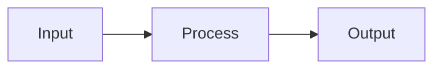

# Codex Loop Skill

通过 Hermes 已配置的 **`codex`** MCP server（`mcp_codex_*` 工具）编排 Codex 开发循环。本 Skill **不内置 MCP 连接**——用户须先在 Hermes 中完成 MCP 配置。

MCP 通用说明见 **`native-mcp`** skill（`skill_view native-mcp`）。

## When to Use

- 完整新需求、bugfix、refactor
- 需要分支隔离 + 多 thread 并行/迭代
- `hermes mcp test codex` 通过，Agent 工具列表含 `mcp_codex_*`

## When NOT to Use

- MCP 未配置 / 工具列表无 `mcp_codex_start`
- 小改动（直接编辑即可）
- 用户尚未安装 `codex` CLI

## Prerequisites（依赖声明）

| 依赖 | 说明 |
|------|------|
| `codex` CLI | 宿主机 PATH 可用 |
| bundled binary | `<skill-root>/assets/bin/codex-mcp-server` |
| Hermes MCP | `~/.hermes/config.yaml` 中 server **`codex`** |

| 配置项 | 位置 | 默认 |
|--------|------|------|
| `CODEX_MCP_APPROVAL_POLICY` | `config.yaml` → `mcp_servers.codex.env` | `approve` |

## MCP Setup（用户手动完成，Agent 不能代劳）

Agent **无法**修改 `~/.hermes/config.yaml`。请用户在本机终端执行：

### 方式 A：setup 脚本 + Hermes CLI（推荐）

```bash
cd <skill-root>
chmod +x scripts/setup.sh
./scripts/setup.sh --verify
./scripts/setup.sh --install    # 调用 hermes mcp add codex（交互勾选工具）
hermes mcp test codex
```

Hermes 会话中执行 **`/reload-mcp`**。

### 方式 B：手改 config.yaml

```yaml
mcp_servers:
  codex:
    command: "/absolute/path/to/codex-loop/assets/bin/codex-mcp-server"
    args: []
    env:
      CODEX_MCP_APPROVAL_POLICY: "approve"
    tools:
      include: [start, reply, process, archive]
      resources: true
      prompts: false
```

详见 [references/mcp-setup.md](references/mcp-setup.md) 与 `assets/mcp-config.example.yaml`。

## Verification（MCP 就绪检查）

- [ ] `hermes mcp list` 含 `codex` 且 enabled
- [ ] `hermes mcp test codex` 成功
- [ ] 用户已 `/reload-mcp`
- [ ] Agent 工具列表含：`mcp_codex_start`, `mcp_codex_reply`, `mcp_codex_process`, `mcp_codex_archive`
- [ ] `codex` CLI 可用

```bash
./scripts/setup.sh --verify
```

未满足 → **停止编排**，引导用户完成 Setup，查 [troubleshooting.md](references/troubleshooting.md)。

## How to Run（MCP 就绪后）

| Hermes 工具 | 用途 |
|-------------|------|
| `mcp_codex_start` | 新建 thread（`description` + `prompt`） |
| `mcp_codex_reply` | 同 thread 修正 |
| `mcp_codex_process` | 轮询进度 |
| `mcp_codex_archive` | 归档 |

参数详见 [references/tools.md](references/tools.md)。**不要**使用裸名 `start`/`reply`。

## Pitfalls

- Agent 不能改 `config.yaml` — 让用户跑 `scripts/setup.sh` 或手改
- 改 config 后未 `/reload-mcp` → 工具列表不更新
- `hermes mcp add` 的工具勾选无法在无 TTY 环境完成 → 用户手动操作
- 完整需求写入 `description` 而非 `prompt`
- stdio server，无 OAuth
- `sandbox` 默认 `danger-full-access`

## Additional Resources

- [references/mcp-setup.md](references/mcp-setup.md)
- [references/tools.md](references/tools.md)
- [references/troubleshooting.md](references/troubleshooting.md)
- [examples.md](examples.md)
- **`native-mcp`** — Hermes MCP 通用文档

---

## Workflow Overview

```
Verify MCP → Classify task → Create branch → (Split modules) → mcp_codex_start
→ Validate → mcp_codex_reply (same thread) → mcp_codex_archive
```

---

## Step 1: Classify the Task

| Type | Branch prefix | Example |
|------|---------------|---------|
| New feature | `feature/` | `feature/user-auth` |
| Bugfix | `bugfix/` | `bugfix/login-redirect-loop` |
| Refactor | `refactor/` | `refactor/extract-payment-service` |

Derive a short, kebab-case slug from the task title.

## Step 2: Create Branch

From the default branch (usually `main` or `master`):

```bash
git checkout -b <prefix>/<slug>
```

Work on this branch for the entire Codex loop. Do not mix unrelated tasks on one branch.

## Step 3: Decompose Complex Tasks

**Split by module** when any of these apply:
- Touches 3+ independent modules/packages
- Has clearly separable deliverables (e.g. API + UI + migration)
- Estimated scope exceeds a single focused session

### Decomposition rules

1. One thread per module or cohesive sub-deliverable.
2. Each thread gets a **narrow, self-contained** `prompt` — not the full epic.
3. Define module boundaries and integration points upfront.
4. Run independent module threads in parallel when possible.
5. Add a final integration thread only if cross-module wiring is needed.

### Example split

Epic: "Add user notification system"

| Thread | Scope |
|--------|-------|
| T1 | `feature/notification-api` — REST endpoints + DB schema |
| T2 | `feature/notification-worker` — background delivery job |
| T3 | `feature/notification-ui` — inbox component + preferences page |

Each thread: own `mcp_codex_start` call on the **same branch**, sequential or parallel.

## Step 4: Write the Requirement (for `mcp_codex_start`)

`mcp_codex_start` has two text fields with different roles:

| Field | Purpose | Content |
|-------|---------|---------|
| `description` | Calling agent judgment & thread tracking | Brief one-line summary (shown in project resource listings) |
| `prompt` | Codex execution | Full requirement in markdown (supports mermaid) |

### `description` guidelines

- One sentence or short phrase — what this thread does
- Used by the calling agent to decide scope and track progress
- Example: `"Implement CSV export API for reports"`

### `prompt` template

```markdown
# <Task Title>

## Type
feature | bugfix | refactor

## Branch
<prefix>/<slug>

## Context
<Why this change is needed, relevant background>

## Scope
### In scope
- ...

### Out of scope
- ...

## Acceptance Criteria
- [ ] ...
- [ ] ...

## Technical Notes
<Constraints, patterns to follow, files to touch>

## Architecture (optional)

```

Keep each thread's `prompt` focused. For multi-thread work, reference sibling threads and integration contracts.

## Step 5: Start Thread

Call **`mcp_codex_start`**:

```json
{
  "description": "<brief task summary for tracking>",
  "prompt": "<full markdown requirement>",
  "cwd": "<absolute project path>",
  "block": true
}
```

`sandbox` defaults to `danger-full-access` (no sandbox restrictions). Omit it unless a narrower mode is explicitly needed.

**Record `thread_id`** from the response. Required for all subsequent `mcp_codex_reply` calls.

---

## Resource Management

通过 MCP resources 管理（需 config 中 `resources: true`）。读 resource 方式见 `native-mcp`。

### Resource URIs

| URI | Purpose |
|-----|---------|
| `project://{project_id}` | List all threads under a project |
| `thread://{project_id}/{thread_id}` | Full thread detail (local state + remote Codex payload) |

### List all projects

通过 MCP resource 列表获取 `project://` 资源（server `codex`）。

### List threads in a project

读取 resource `project://{project_id}`：

Response shape:

```json
{
  "project_id": "abcd1234",
  "cwd": "/absolute/path/to/project",
  "threads": [
    {
      "thread_id": "thread-abc",
      "thread_uri": "thread://abcd1234/thread-abc",
      "status": "running",
      "description": "Initial task summary"
    }
  ]
}
```

Use this as the **dashboard** when orchestrating multiple module threads across one or more repos.

### Read a single thread

读取 resource `thread://{project_id}/{thread_id}`。深度检查优先 `mcp_codex_process`，需要对话历史时再读 resource。

### Multi-project workflow

When working across repos, each repo's `cwd` becomes a separate project:

```
project://a1b2c3d4  →  /path/to/backend   (2 threads)
project://e5f6g7h8  →  /path/to/frontend  (1 thread)
```

Track all active threads by periodically reading each project's resource.

---

## Async Mode

Set `"block": false` on `mcp_codex_start` or `mcp_codex_reply` to return immediately without waiting for the turn to finish.

### Async mcp_codex_start / mcp_codex_reply

```json
{
  "description": "<brief summary>",
  "prompt": "<requirement>",
  "cwd": "<absolute path>",
  "block": false
}
```

Response:

```json
{
  "thread_id": "thread-abc",
  "content": null,
  "blocked": false
}
```

Same shape for async `mcp_codex_reply` — returns `thread_id` immediately, `content` is null.

### When to use async

- Running **multiple module threads in parallel** on the same branch
- Long-running tasks where you want to monitor progress without blocking
- Orchestrator pattern: spawn threads, poll status, validate as each completes

### Completion notification

Non-blocking calls emit `notifications/codex/thread/completed` when the turn finishes:

```json
{
  "thread_id": "thread-abc",
  "project_id": "abcd1234",
  "status": "completed",
  "content": "<final agent response>",
  "error": null
}
```

`status` values: `starting`, `running`, `waiting_approval`, `completed`, `failed`, `interrupted`.

Resource update notifications are also sent for the thread and project URIs — re-read the resource to get the latest state.

### Approval during async runs

If Codex needs command/file approval, status becomes `waiting_approval` and `notifications/codex/approval/request` is emitted. Policy is controlled by `CODEX_MCP_APPROVAL_POLICY` (`approve` | `session` | `deny`).

---

## Query Progress

Three ways to check thread progress, from lightest to most detailed:

### 1. `mcp_codex_process`（推荐轮询）

```json
{ "thread_id": "<thread_id>" }
```

Returns `ThreadRecord`:

| Field | Meaning |
|-------|---------|
| `status` | `starting` / `running` / `waiting_approval` / `completed` / `failed` / `interrupted` |
| `process` | Ordered execution trace (commands, file changes, tool calls, turn events) |
| `final_response` | Latest agent message when completed |
| `error` | Error message when failed |
| `description` | Initial task summary |

Poll every 10–30s during async runs. Stop polling when `status` is `completed` or `failed`.

### 2. Read thread resource

`thread://{project_id}/{thread_id}`

Use when you need both local trace **and** remote Codex conversation history (`remote` field with `include_turns`).

### 3. Read project resource（批量概览）

`project://{project_id}`

Scan all threads' `status` in one call — ideal for multi-thread orchestration dashboards.

### Progress polling pattern (async)

```
1. mcp_codex_start/reply with block=false  →  get thread_id
2. loop:
     a. mcp_codex_process(thread_id)  →  check status
     b. if running/starting/waiting_approval  →  wait, retry
     c. if completed  →  validate, proceed
     d. if failed  →  mcp_codex_reply with fix or escalate
3. mcp_codex_archive(thread_id) when done
```

### Status-driven actions

| Status | Action |
|--------|--------|
| `starting` / `running` | Wait, continue polling |
| `waiting_approval` | Check approval policy; may need user intervention |
| `completed` | Validate output, then `mcp_codex_archive` or `mcp_codex_reply` to fix |
| `failed` | Read `error` + `mcp_codex_process`, then `mcp_codex_reply` with corrective prompt |
| `interrupted` | `mcp_codex_reply` to resume or `mcp_codex_start` new thread if context is lost |

## Step 6: Validate Results

After `mcp_codex_start` (or `mcp_codex_reply`) completes with `block: true`:

1. **Inspect output** — read `content` in the tool result.
2. **Check the codebase** — verify files changed, tests pass, acceptance criteria met.
3. **Use `mcp_codex_process`** if execution trace or status is unclear:

```json
{ "thread_id": "<thread_id>" }
```

### Validation checklist

- [ ] All acceptance criteria satisfied
- [ ] No unrelated files modified
- [ ] Code compiles / tests pass (run locally)
- [ ] Matches project conventions

## Step 7: Iterate with Reply

If validation fails, **stay on the same thread** — do not start a new one for corrections.

Call **`mcp_codex_reply`**:

```json
{
  "thread_id": "<thread_id>",
  "prompt": "<specific correction instructions>",
  "block": true
}
```

### Reply prompt guidelines

- State exactly what failed validation (be specific, cite files/lines/behaviors).
- List remaining acceptance criteria not yet met.
- Do not repeat the entire original requirement — reference what already exists.
- One focused correction per reply when possible; batch related fixes together.

Repeat validate → reply until acceptance criteria pass or the user intervenes.

## Step 8: Archive Thread

When a thread's work is complete and validated:

```json
{ "thread_id": "<thread_id>" }
```

Call **`mcp_codex_archive`** to remove it from project listings. Archive each module thread independently in multi-thread workflows.

## Multi-Thread Coordination

When running multiple threads on one branch:

1. **Order**: schema/migrations → backend API → frontend → integration.
2. **Context passing**: later threads' descriptions should reference artifacts from earlier threads (file paths, API contracts).
3. **Conflict avoidance**: if two threads touch the same files, serialize them or narrow scope.
4. **Track state** via project resource or local notes:

```
Branch: feature/notification-system
Project: project://abcd1234
├── thread://abcd1234/abc — notification-api (completed → archived)
├── thread://abcd1234/def — notification-worker (running)
└── thread://abcd1234/ghi — notification-ui (pending)
```

## Quick Reference

| Action | Hermes tool | Key params / URI |
|--------|-------------|------------------|
| New work unit | `mcp_codex_start` | `description`, `prompt`, `cwd`, `block` |
| Fix / refine | `mcp_codex_reply` | `thread_id`, `prompt`, `block` |
| Poll progress | `mcp_codex_process` | `thread_id` |
| List projects | MCP resources | `project://...` |
| List threads | MCP resource read | `project://{project_id}` |
| Thread detail | MCP resource read | `thread://{project_id}/{thread_id}` |
| Clean up | `mcp_codex_archive` | `thread_id` |
| Async completion | notification | `notifications/codex/thread/completed` |

## Anti-Patterns

- Starting a new thread for minor fixes — use `mcp_codex_reply` on the existing thread.
- Dumping an entire epic into one thread — split by module.
- Skipping branch creation — always isolate work.
- Vague reply prompts — always cite concrete failures.
- Forgetting to archive — leads to cluttered project thread listings.
- Blocking on parallel threads — use `block: false` and poll via `mcp_codex_process` or project resource.
- Polling only at the end — check `mcp_codex_process` or project resource while long turns are running.
